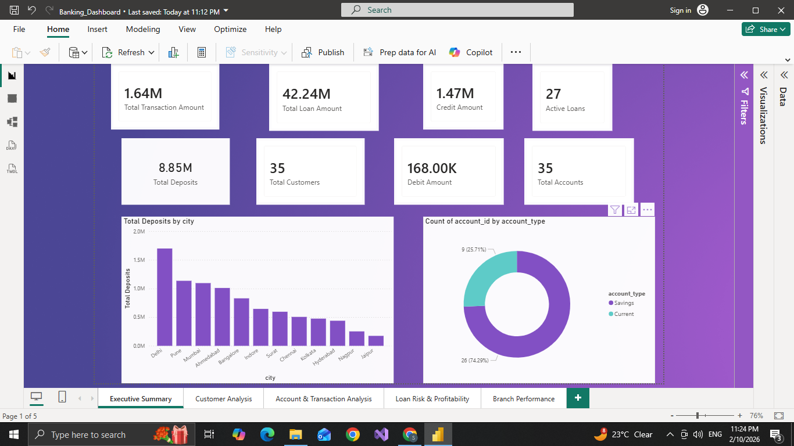

# Banking-Finance-SQL-PowerBI-Project
Banking Analytics Dashboard using SQL and Power BI

## 📌 Project Overview
This project analyzes banking data to understand customer behavior, transaction trends, loan risk, and branch performance.

The goal is to help the bank improve profitability and reduce financial risk using SQL and Power BI.

---

## 🛠 Tools & Technologies
- MySQL (Database)
- SQL Queries (Data Analysis)
- Power BI (Dashboard & Visualization)
- GitHub (Project Hosting)

---

## 📂 Dataset Information
The database contains 5 tables:

- Customers
- Accounts
- Transactions
- Loans
- Branches

Each table has 35+ realistic records.

---

## 📊 Dashboard Pages

### 1️⃣ Executive Summary
- Total Customers
- Total Deposits
- Active Loans
- Account Type Distribution

### 2️⃣ Customer Analysis
- Customers by City
- Gender Distribution
- High-value Customers

### 3️⃣ Transaction Analysis
- Credit vs Debit Trends
- Monthly Transaction Activity

### 4️⃣ Loan Risk & Profitability
- Loan Portfolio by Type
- Active vs Closed Loans
- Interest Income Estimation

### 5️⃣ Branch Performance
- Deposits by Branch
- Branch Risk Exposure

---

## 🔍 Key Insights
- Metro cities contribute the highest deposits.
- Current accounts maintain higher balances.
- Home loans generate maximum interest income.
- Few branches contribute majority of deposits.
- Customers with multiple active loans are higher risk.

---

## 📌 Business Impact
✔ Improved decision-making for branch expansion  
✔ Early identification of high-risk loan customers  
✔ Better customer segmentation for targeted marketing  

---

## DASHBOARD Preview

---

## 🚀 How to Use
1. Run SQL scripts from `1_SQL_Scripts/`
2. Open `.pbix` file in Power BI
3. Explore dashboard with slicers and filters

---

## 👩‍💻 Author
**Sanika Jagtap**  
Aspiring Data Analyst | SQL | Power BI | Python  
